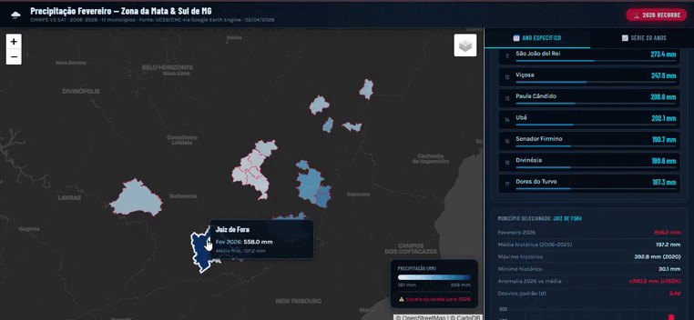

# 🌧️ Extreme Climate Events Monitor | Geospatial ETL & WebGIS



> **An automated, serverless Python pipeline leveraging Google Earth Engine (GEE) to monitor extreme precipitation anomalies and generate self-contained interactive WebMaps.**

## 📌 Executive Summary

In February 2026, the *Zona da Mata* region in Minas Gerais, Brazil, faced an unprecedented climate catastrophe. Extreme rainfall led to public calamity, severe infrastructure collapse, and tragic loss of life. 

This project is a **Data Engineering and Geospatial Analysis pipeline** built to quantify this event. It extracts 20 years of satellite precipitation data, processes the spatial statistics in the cloud, and dynamically renders a zero-dependency interactive dashboard to visualize the anomalies.

## ⚙️ Architecture & Technical Approach

Instead of downloading gigabytes of raw raster data to local machines, this pipeline adheres to modern cloud architecture principles:

1. **Cloud Computing (Data Extraction):** Utilizes the Google Earth Engine Python API to filter 20 years (2006-2026) of daily satellite imagery (`CHIRPS V3 DAILY_SAT`). The heavy lifting (spatial reduction and clipping) is delegated to Google's clusters.
2. **Spatial ETL (Data Transformation):** Uses `GeoPandas` to harmonize topological data (handling string normalization and CRS standardization) and `Pandas` to calculate historical means, standard deviations, and anomalies.
3. **Serverless WebGIS (Data Load/Visualization):** The Python script serializes the processed datasets into JSON and injects them directly into a pre-architected HTML/JS template. The output is a **100% autonomous, offline-capable WebMap** powered by `Leaflet.js` and `Chart.js`, requiring no backend infrastructure to host.

## 🛠️ Tech Stack

* **Geospatial & Cloud:** Google Earth Engine (Python API), GeoPandas, Shapely.
* **Data Processing:** Pandas, NumPy.
* **Frontend / Visualization:** HTML5, CSS3, JavaScript (Vanilla), Leaflet.js, Chart.js.
* **Concepts Applied:** Spatial ETL, JIT Data Injection, Cloud-native Geoprocessing, Singleton Caching (avoids redundant GEE API calls).

## 📊 Key Findings (Feb 2026 Anomaly)

The algorithm statistically proves the severity of the event. February 2026 became the wettest month in the recorded history of **Juiz de Fora (MG)**:
* **Precipitation Recorded:** 558 mm (Polygon spatial mean).
* **Historical Mean (2006-2025):** 197 mm.
* **Anomaly Detected:** **+183%** above the historical average.
* Critical alerts triggered for neighboring municipalities such as Pequeri (+167%) and Barão do Monte Alto (+143%).

## 🗄️ Data Sources
* **Satellite Rasters:** [UCSB-CHC/CHIRPS/V3/DAILY_SAT](https://developers.google.com/earth-engine/datasets/catalog/UCSB-CHC_CHIRPS_V3_DAILY_SAT) (Near-real-time, IMERG-based).
* **Vector Boundaries:** Brazilian Institute of Geography and Statistics (IBGE - 2024).

---

## 🚀 How to Reproduce Locally

**1. Clone the repository and install dependencies**
```bash
git clone [https://github.com/PedroLuizskt/gee-precipitation-webmap-mg.git](https://github.com/PedroLuizskt/gee-precipitation-webmap-mg.git)
cd gee-precipitation-webmap-mg
pip install -r requirements.txt
```

**2. Setup Vector Data (Single Source of Truth)**
To keep the repository lightweight, raw shapefiles are excluded. 
* Download the 2024 Municipalities shapefile from the [IBGE Portal](https://www.ibge.gov.br/geociencias/organizacao-do-territorio/malhas-territoriais/15774-malhas.html).
* Create a folder named `data/BR_Municipios_2024/` in the root directory.
* Extract the `.shp`, `.shx`, `.dbf`, and `.prj` files into this folder.

**3. Authenticate and Execute**
```bash
python script.py
```
*Note: Upon first execution, the `earthengine-api` will prompt you to authenticate with a Google account to access the free GEE clusters.*

**4. View Results**
Check the `output/` folder. Open the newly generated `webmap_precipitacao_fevereiro.html` in any modern web browser.

---

### 👨‍💻 Author
**Pedro Luiz R. Vaz de Melo**
*Forest Engineer | Geospatial Data Scientist | GIS Developer*
* [LinkedIn](https://www.linkedin.com/in/pedro-luiz-rodrigues-vaz-de-melo/)
* [Portfolio/GitHub](https://github.com/PedroLuizskt)

---
